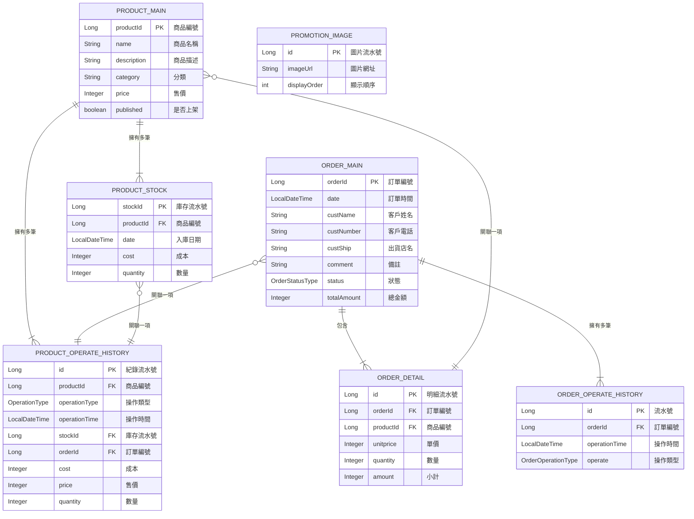

# 簡易線上購物系統 (Simple Online Shopping System)

這是一個使用 Spring Boot 3 和 Vue.js 2 建立的簡易線上購物系統專案。後端作為 RESTful API 伺服器，前端則採用前後端分離的模式開發。

## 專案預覽 (Screenshots)

**前台首頁**


**後台管理頁面**


## 主要功能 (Features)

### 後台管理
- [x] **行銷圖片管理**：新增、刪除網站首頁上方的行銷圖片。
- [x] **商品管理**：新增、編輯、刪除商品基本資料。
- [x] **簡易庫存管理**：進出貨紀錄。
- [x] **訂單管理**：查詢訂單、更新訂單狀態（例如：標示為已出貨）。

### 前台網站
- [x] **一頁式商店**：
    - 上半部顯示動態的行銷圖片。
    - 下半部以三欄式列表展示所有已上架商品。
- [x] **購物車功能**：
    - 將商品加入購物車。
    - 購物車內容儲存於瀏覽器 `localStorage`。
    - 浮動按鈕即時顯示購物車商品總數。
- [x] **結帳流程**：
    - 購物車摘要頁面。
    - 填寫顧客訂購資訊。
- [x] **歷史訂單查詢**：可透過訂單編號或電話查詢訂單。

## 技術棧 (Tech Stack)

* **後端 (Backend)**
    * Java 17
    * Spring Boot 3
    * Spring Web
    * Spring Data JPA (Hibernate)
    * Jakarta Bean Validation
* **前端 (Frontend)**
    * Vue.js 2
    * BootstrapVue
    * Element UI (for Admin)
    * Font Awesome
    * http-vue-loader (for loading `.vue` components without a build step)
* **資料庫 (Database)**
    * H2 Database (開發用)
* **建置工具 (Build Tool)**
    * Maven

## 快速開始 (Getting Started)

### 1. 環境準備 (Prerequisites)
請確保您的環境中已安裝以下軟體：
* JDK 17 或更高版本
* Maven 3.6 或更高版本
* Git

### 2. 下載專案 (Clone)
```bash
git clone [您的專案 Git URL]
cd [專案資料夾名稱]
```

### 3. 執行後端 (Run Backend)
* **使用 IDE**：將專案作為現有的 Maven 專案匯入您的 IDE (例如 Eclipse, IntelliJ IDEA)。找到 `WorkshopApplication.java` (或您專案的主啟動類別)，右鍵點擊並選擇 `Run As` -> `Spring Boot App`。
* **使用 Maven 指令**：
    ```bash
    mvn spring-boot:run
    ```
應用程式將會啟動在 `http://localhost:8080`。

### 4. 訪問頁面 (Access Frontend)
* **前台商店首頁**：[http://localhost:8080/](http://localhost:8080/)
* **後台管理頁面範例**：[http://localhost:8080/html/admin/admin-product.html](http://localhost:8080/html/admin/admin-product.html)
* **H2 資料庫後台**：[http://localhost:8080/h2-console](http://localhost:8080/h2-console)
    * JDBC URL: `jdbc:h2:file:./data/workshop`
    * User Name: `sa`
    * Password: (空白)

## 資料實體圖 (ERD)



## 未來計畫 (To-Do)
- [ ] 實作後台登入

## 授權 (License)
本專案採用 [MIT](https://choosealicense.com/licenses/mit/) 授權條款。
